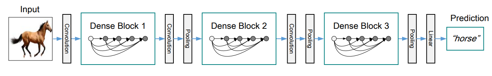

# L&amp;T Hackathon Shaastra'23

**Team Name**: codeity  
**Team Members**: Arun Palaniappan  

## Approach

The Problem Statement requires us to use Transfer learning based CNN architecture for classifying ships into categories.

### Model

I have taken a pre-trained **DenseNet-201** model, unfroze the last layer to train on our dataset.  
Here is a representation of the architecture:

## Results

| Metrics | Test Split |
| :----- | :-----: |
| Kappa score |**0.9346** |
